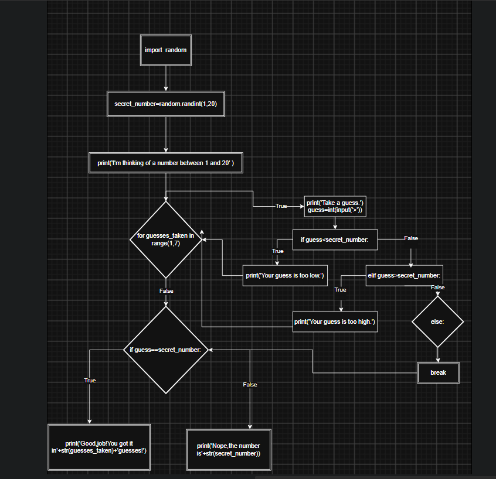

# My 30-Day Programming Experiment

It feels unreasonable to set specific programming goals when I do not yet have enough experience to judge what is important in programming.

At first, I asked several AI assistants for advice about where I should begin. I received many different recommendations.

Gemini suggested resources such as:

- *Learn X in Y Minutes*
- *The Missing Semester of Your CS Education*
- freeCodeCamp
- Roadmap.sh
- *Automate the Boring Stuff with Python*
- *Practical Python Programming*
- Real Python

ChatGPT suggested:

- Exercism
- Roadmap.sh
- *Teach Yourself Computer Science*
- CS50x 2026

I also asked Copilot, but its suggestions were too specific for my current situation. They gave me goals without giving me a clear syllabus or a reliable way to decide what I should learn first.

The amount of information almost overwhelmed me.

However, one piece of advice seemed particularly relevant:

> Smart people often try to map out every theory, system, and framework before taking action, because doing so creates a sense of security. But in programming, this habit can lead to endless preparation and burnout.

Programming is not only a theoretical subject. It is also a practical craft that must be developed through practice. Learning programming is somewhat like learning to ride a bicycle: reading about the physics of bicycles can be useful, but it cannot replace actually getting on the bicycle and trying to ride.

## My choice for the first 30 days

For the first month, I will use *Automate the Boring Stuff with Python* as my primary learning resource.

I will not treat finishing the book as my main goal. Instead, I will use the book as a source of practical examples and experiments.

Each day, I will:

1. Read a small section.
2. Choose an example that I can understand or investigate.
3. Reproduce the code myself instead of only copying it.
4. Run the program and observe what happens.
5. Change part of the code and test the result.
6. Try to identify and fix at least one problem or limitation.
7. Record what I learned and what I still do not understand.

## What I want to learn from each example

For each program, I will try to answer:

- What real problem is this program solving?
- What information does it receive?
- What does it do with that information?
- What result does it produce?
- Which parts of the code are responsible for each step?
- What assumptions does the program make?
- What happens when the input is unusual or invalid?
- Can I modify the program to make it more useful to me?

## A realistic definition of progress

During these 30 days, progress does not simply mean reading more pages or writing more lines of code.

I will consider an example meaningful when I can:

- explain its basic purpose
- run it successfully
- modify at least one part of it
- test it with different inputs
- identify at least one limitation
- explain what I still do not understand

I will use AI assistants as learning tools, but I will not treat their explanations or generated code as automatically correct. I will ask them to explain, compare, and help me debug, while using my own tests to check the results.

## Weekly reflection

At the end of each week, I will record:

- What did I learn?
- What did I build or modify?
- What problems did I encounter?
- Which concepts became clearer?
- Which concepts are still confusing?
- What should I explore next?

## My goal after 30 days

My goal is not to become a programmer in 30 days or to decide my entire career direction.

My goal is to gain enough practical experience to make better judgments about programming:

- what it can do
- what it cannot do
- which parts interest me
- which problems I may want to solve
- how coding agents can help me
- what I should learn next

This 30-day plan is an experiment, not a commitment to follow one path forever. I will adjust it when my experience gives me better information.

# My Programming Learning Notes

## Day 00

To begin with, I read the introduction. Several ideas and examples impressed me.

The book introduced a simple password-checking program:

```python
password_file = open("SecretPasswordFile.txt")
secret_password = password_file.read()

print("Enter your password.")
typed_password = input()

if typed_password == secret_password:
    print("Access granted")
    if secret_password == "12345":
        print("That password is one that an idiot puts on their luggage.")
else:
    print("Access denied")
```

What impressed me was the author's systematic way of teaching. The example was simple, but it showed how a program can:

1. read information from a file
2. ask the user for input
3. compare two values
4. make a decision
5. display different results

One idea that may be useful for my future learning is:

> Programming requires deduction and attention to detail.

I am beginning to understand that a computer cannot infer my intention in the same way that a human can. I need to express each step clearly.

## Day 01

I read Chapter 1, **Python Basics**, in about eight hours.

I wrote down some important sentences in Obsidian, reproduced all the code in the chapter, and completed and corrected the exercises at the end.

## Summary

The chapter introduced several basic concepts:

- values
- operators such as `+`, `-`, `*`, `/`, `%`, and `**`
- expressions
- statements
- data types
- strings
- integers
- floating-point numbers
- type conversion
- input and output
- string operations

My current understanding is:

- An expression produces or evaluates to a value.
- An assignment statement associates a value with a variable name.
- Different values have different data types.
- Input allows a program to receive information.
- Output allows a program to show information.

Although the chapter was not very long, I had difficulty recalling everything after reading it. I remembered much less than I expected. This was frustrating, but it also showed me that reading and recalling are different activities.

## Exercise and Corrections

I completed the exercises at the end of the chapter and corrected my mistakes.

I will add more details about the exercises tomorrow.

## Questions for Further Review

- What is the difference between an expression and a statement?
- Why does `input()` always return a string?
- How does type conversion work?
- What is the difference between an integer and a floating-point number?
- Which string operations do I still need to practice?

## Next Step

I will review Chapter 1 briefly and write a small program without copying the example directly from the book.

## Day 02

Today, I spent 2.5 hours learning about `if` statements and flow control.

### Main knowledge

#### Boolean values

Boolean values have only two possible values:

```python
True
False
```

#### Boolean operators

The Boolean operators in Python are:

```python
and
or
not
```

`and` and `or` combine Boolean expressions. `not` reverses the truth value of one expression.

#### Comparison operators

The main comparison operators are:

```text
==    equal to
!=    not equal to
<     less than
>     greater than
<=    less than or equal to
>=    greater than or equal to
```

A comparison produces a Boolean value.

For example:

```python
age = 33

print(age < 40)  # True
print(age == 18) # False
```

Comparison operators can be combined with Boolean operators:

```python
age = 33
has_ticket = True

print(age > 18 and has_ticket)  # True
```

#### Flowcharts

A flowchart is an intuitive way to understand the flow of a program. It can show the different steps and decisions before I write the code.

#### `if`, `elif`, and `else`

The basic structure is:

```python
if condition:
    # execute this branch if the condition is True
elif another_condition:
    # execute this branch if the first condition is False
    # and the second condition is True
else:
    # execute this branch if all previous conditions are False
```

My current understanding is:

```text
if / elif: If the condition is True, execute that branch.
else: If all previous conditions are False, execute this branch.
```

`if` and `elif` require conditions, but `else` does not have its own condition. `else` represents the remaining case: none of the previous conditions is true.

For example:

```python
name = "Bob"
age = 10

if name == "Alice":
    print("Hi, Alice.")
elif age < 12:
    print("You are not Alice, kiddo.")
else:
    print("You are neither Alice nor a child.")
```

In this example:

- If `name == "Alice"` is `True`, Python executes the `if` branch.
- If the `if` condition is `False` but `age < 12` is `True`, Python executes the `elif` branch.
- If both conditions are `False`, Python executes the `else` branch.

Only one branch in this `if`/`elif`/`else` structure is executed.

The `else` branch does not necessarily need to produce output. It can perform another action:

```python
age = 20

if age < 18:
    print("You are a minor.")
else:
    age = age + 1
```

In this example, the `else` branch is executed, but it does not print anything. It changes the value of `age` instead.

### My thoughts about the example

I did not like one of the examples in this chapter because its logic did not feel realistic to me:

```python
name = "Alice"
age = 33

if name == "Alice":
    print("Hi, Alice.")
elif age < 12:
    print("You are not Alice, kiddo.")
```

The second condition is only checked when the person is not Alice, so the two conditions do not seem closely related.

I think this example was mainly designed to demonstrate the order of `if` and `elif`, rather than to represent realistic program logic.

This helped me notice that an example can be useful for demonstrating syntax without being a good model of real-world program design.

## Exercise: Opposite Day

I completed the short program about “Opposite Day,” but I do not have much cultural background about this idea. When I ran the same code, I was confused about its specific logic.

I currently understand that the exercise is based on the imaginary idea that people should say the opposite of what they mean on “Opposite Day.” However, I still need to examine the code step by step to understand how the conditions change the output.

## Questions for further review

- What exactly is the difference between `if` and `elif`?
- Why does Python stop checking later branches after one condition is `True`?
- How should I organize several related conditions?
- When is a Boolean expression clearer if I split it into separate variables?
- What is the difference between a realistic condition and an example designed mainly to demonstrate syntax?


# Day 03

Yesterday afternoon and today, I spent some time reading and typing the code examples in Chapter 3, **Loops**.

## Knowledge

At the end of an `if` statement, program execution continues with the code after the statement.

At the end of a `while` loop, program execution jumps back to the beginning of the loop and checks the condition again.

Loops are useful for automation because they allow a program to repeat an action many times. A computer can perform thousands of repetitions in a few seconds.

A `for` loop is often used when I want to iterate over a sequence or repeat something a known number of times.

A `while` loop is often used when I want to continue repeating an action as long as a condition remains `True`.

### `break`

`break` immediately exits the current loop.

### `continue`

`continue` skips the rest of the current iteration and proceeds to the next iteration of the loop.

## My Understanding

The basic difference between an `if` statement and a loop is:

- An `if` statement checks a condition and usually chooses whether to execute a block once.
- A loop checks a condition or iterates over a sequence and may execute a block repeatedly.

A loop must eventually stop. Otherwise, it may become an infinite loop.

## Output

I drew several flowcharts to represent the execution flow of the code examples in this chapter.

Drawing the flowcharts helped me understand how the program moves back to the beginning of a loop and how `break` and `continue` change the normal flow.

## Questions for Further Review

- What is the difference between a `for` loop and a `while` loop in practice?
- How can I make sure that a `while` loop eventually stops?
- What is the difference between `break` and `continue`?
- How does indentation determine which statements belong to a loop?



```python
# This is a guess the number game.
import random
secret_number = random.randint(1, 20)
print('I am thinking of a number between 1 and 20.')

for guesses_taken in range(1, 7):
    print('Take a guess.')
    guess = int(input('>'))

    if guess < secret_number:
        print('Your guess is too low.')
    elif guess > secret_number:
        print('Your guess is too high.')
    else:
        break

if guess == secret_number:
    print('Good job! You got it in ' + str(guesses_taken) + ' guesses!')
else:
    print('Nope. The number was ' + str(secret_number))
The code above corresponds to the flowchart shown in the image.
```

I spent almost an hour drawing this flowchart in diagrams.net, mostly because I was learning how to use the tool. I think the drawing itself would have taken only a few minutes. I probably will not use this flowchart tool again.

## Day 04

I learned Chapter 4, **Functions**, somewhat slowly.

The concepts that felt most unfamiliar in this chapter were the **call stack** and **frames**.

The call stack is like stacking plates: each function call is added to the top, and the program must return to the previous layer from top to bottom. In other words, Python keeps track of which function called which function, and returns to the right place after the current function finishes.

### Main knowledge

#### Arguments and parameters

Arguments and parameters are related but not the same thing.

- A **parameter** is a variable defined in the function definition.
- An **argument** is the value passed to the function when the function is called.

This allows the same function to be reused for different inputs instead of writing duplicate code.

#### Return values and `return` statements

A function can produce a value using `return`.

The `return` statement does two things:

1. It sends a value back to the caller.
2. It stops the current function immediately.

This is important because the function will not continue to run after `return` is executed.

Example:

```python
def f():
    for i in range(3):
        if i == 1:
            return i
    return 99
```
The return value in this example is `1`. The `return` statement that produces this value is `return i`, which returns `1` when `i == 1`.

You may have the same question as I did: why does `return 99` not play a role in this example?

The indentation of the code is important because it represents the execution structure. The `for` loop and `return 99` are at the same level of indentation. When `i == 1`, the function executes `return i`. In this case, `i` is `1`, so the function returns `1` and ends immediately. Execution then returns to the code outside the function. Therefore, `return 99` is never executed.

Another example is:

```python
def f():
    return lambda x: x + 1

g = f()
print(g)
```

In this example, the return value is a function object.

The call `f()` returns the function object created by the `lambda` expression, and that function object is stored in the variable `g`. Therefore, `print(g)` works because `g` refers to the returned function object.

The other important concept is the difference between `print` and `return`. Here are two examples.

### Example A: Using `print`

```python
def add_with_print(a, b):
    print(a + b)

x = add_with_print(2, 3)
print(x)
print(x + 10)
```

The function prints `5` on the screen successfully. However, it does not return the value `5`. Because there is no explicit `return` statement, Python implicitly returns `None`.

Therefore, `print(x)` prints:

```python
None
```

Then `print(x + 10)` causes an error because `x` is `None`, not `5`. The value `5` was displayed on the screen, but it was not stored in `x`.

### Example B: Using `return`

```python
def add_with_return(a, b):
    return a + b

y = add_with_return(2, 3)
print(y)
print(y + 10)
```

In this example, `add_with_return(2, 3)` returns `5`, so the value `5` is stored in `y`.

Therefore:

```python
print(y)
```

prints:

```python
5
```

and:

```python
print(y + 10)
```

prints:

```python
15
```

The difference is that `print()` only displays a value on the screen, while `return` sends a value back to the code that called the function.

### Global variables and local variables

The position of a variable is important because it can determine the result.

#### Example A

```python
def spam():
    global eggs
    eggs = 'spam'

eggs = 'global'
spam()
print(eggs)
```

This prints:

```python
spam
```

The `global` keyword tells Python that `eggs` refers to the global variable. When `spam()` is called, the global variable `eggs` is changed to `'spam'`.

#### Example B

```python
def spam():
    global eggs
    eggs = 'spam'

spam()
eggs = 'global'
print(eggs)
```

This prints:

```python
global
```

The assignment `eggs = 'global'` occurs after the call to `spam()`. Therefore, the later assignment redefines the value of `eggs` as `'global'`.

These examples show that both the scope of a variable and the order of execution are important.


 
